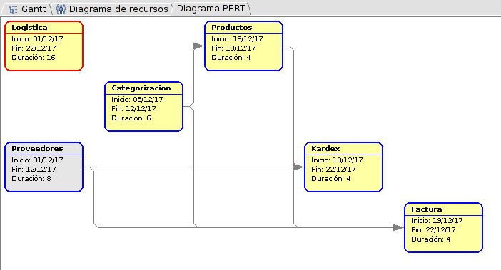
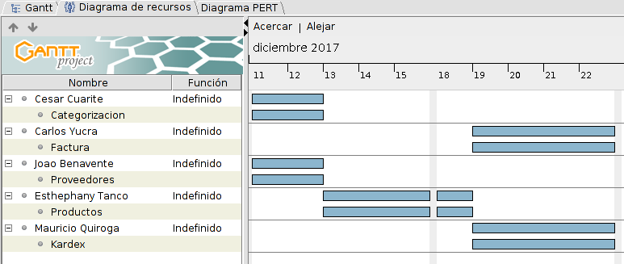

.. _desarrollo:

Ejecución del Proyecto Minierp en el Módulo de  Logística
=========================================================

Gestión de las Comunicaciones
-----------------------------

1. Informe de desempeño del proyecto
^^^^^^^^^^^^^^^^^^^^^^^^^^^^^^^^^^^^

Se elaboraron informes semanales y fueron enviados al cliente presentando el avance semanal de cada submódulo de Logística, los cuáles fueron revisados y corrigiendo algunos aspectos.

Incluyendo los procesos relacionados con la planificación de los riesgos, su identificación y análisis, el planteamiento de respuestas a dichos riesgos y el seguimiento y control de la gestión de los riesgos del proyecto en la búsqueda de incrementar la probabilidad de ocurrencia de aquellos positivos y disminuir o eliminar la ocurrencia de aquellos negativos

    
2. Comunicaciones y Reuniones Internas
^^^^^^^^^^^^^^^^^^^^^^^^^^^^^^^^^^^^^^

Para tener una muy buena comunicación debemos de tener un seguimiento y un control para lo cual en la parte de Logística seguimos:

Comunicaciones internas: se realizó para saber como esta el avance de cada parte del proceso de Logística, que en un inicio se dividió, en las cuales nos guiamos de nuestra ruta crítica como se ve en la siguiente imagen.  

En la parte general de todo el MiniERP se realizó la parte de liderazgo en donde cada líder de cada grupo se reunía para saber como iban los avances de documentación y desarrollo. Esto nos da ventaja ante el mundo comercial porque trabajar en equipo y tener una buena comunicación para estar al tanto de todo; nos hace estar a un paso más adelante de nuestra competencia.

Reuniones internas: en nuestras internas nos juntamos para saber que campos tendríamos en nuestros registros, lo que mostraremos en la tablas, las partes enlazadas con otros grupos, la documentación y principalmente el desarrollo en general.

Herramientas y Técnicas
-----------------------

Para realizar un software completo se utilizó herramientas y técnicas que son:

Herramientas utilizadas en la Documentación:
^^^^^^^^^^^^^^^^^^^^^^^^^^^^^^^^^^^^^^^^^^^^

- GanttProject: herramienta que se utilizó para hacer la ruta crítica de la parte de Logística.
- WBSTools: herramienta que se utilizó para hacer el cronograma de la parte de Logística.
- StarUML: herramienta que se utilizó para la gran parte de documentación.
- Word: la herramienta donde se presentó los manuales, informes, y tambien se utilizo para hacer algunas plantillas de documentación como casos de uso.
- Balsaminq: herramienta para la realización de las vistas de las posibles interfaces de la parte de Logística.

Herramientas utilizadas en el Desarrollo, se realizó control de versiones:
^^^^^^^^^^^^^^^^^^^^^^^^^^^^^^^^^^^^^^^^^^^^^^^^^^^^^^^^^^^^^^^^^^^^^^^^^^

- Java y Eclipse: en estas herramientas se desarrolló la parte de código del MiniERP en general.
- GitLab: en esta herramienta se desarrolló la parte de servicio web de control de versiones y desarrollo de software colaborativo.
- Maven: es una herramienta de software para la gestión y construcción de proyectos Java, que se utilizara en la parte de Logística.
- Spring framework: es una framework  para el desarrollo de aplicaciones y contenedor de inversión de control, de código abierto para la plataforma Java.

Las técnicas utilizadas son:
^^^^^^^^^^^^^^^^^^^^^^^^^^^^

- Análisis de Riesgos: en lo cual nos reunimos para tomar en cuenta que pasaria si añadimos o quitamos algunas partes de Logística.

  Por ejemplo: Para saber que campos se llenaria para el Registro de Producto se evaluó y modificó la base de datos. Lo que falto fue guardar en documentación dicho arreglo como una hoja de control; en vez de ello se reactualizó los diagramas, requerimientos y casos de uso de dicho cambio.

  Si también documentabamos las hojas de control, obtendriamos mejor control y documentación de dicho proyecto.

  También se evaluo el tiempo para la realización de dicho proyecto en donde pusimos fechas a realizar y encargados de dichas partes de Logística como se ve en la siguiente imagen.

- Analisis FODA: este análisis lo realizamos en conjunto para saber las habilidades, destrezas y debilidades del grupo en reunión por el medio oral. También nos ayudó a ver hasta donde avanzaron el grupo anterior, donde tuvimos como resultado que no había mucho avance. En esta parte nos faltó documentar dicho análisis,  para tener una mejor documentación. 

- ISO 10.006: es aplicable a proyectos de complejidad variable, pequeña o grande, de corta o larga duración, en diferentes entornos, e independientemente del tipo de producto o proceso involucrado. Esto puede requerir una adaptación de la orientación para adaptarse a un proyecto en particular con este ISO evaluamos la Calidad de Software.  

- Por ejemplo: desde un inicio hubo planificación, organización, seguimiento, control e informe de la mayoría de los aspectos del proyecto y la motivación de todos aquéllos que están involucrados en él para alcanzar los objetivos del proyecto.

Gestión de la Información 
-------------------------

El sistema para la gestión de información debe incluir procedimientos para preparar, recoger, identificar, clasificar, distribuir, actualizar, archivar y recuperación de información. Esta información es de suma importancia para los receptores  en donde debe ser clara, precisa y distribuida para que tenga una efectividad real [12].

Por ejemplo: en este proyecto se tuvo que realizar elicitación y educción de la información para poder plasmar y realizar los requerimientos de los cuales se hizo los casos de uso, diagramas de estados, secuencia y actividades. Para que se visualice los posibles escenarios y se sepa con exactitud de la información recabada y lo que se quiere. 

Dando a saber en donde se encuentra nuestro requerimiento y en que parte de nuestro desarrollo está realizada dicho requerimiento.

